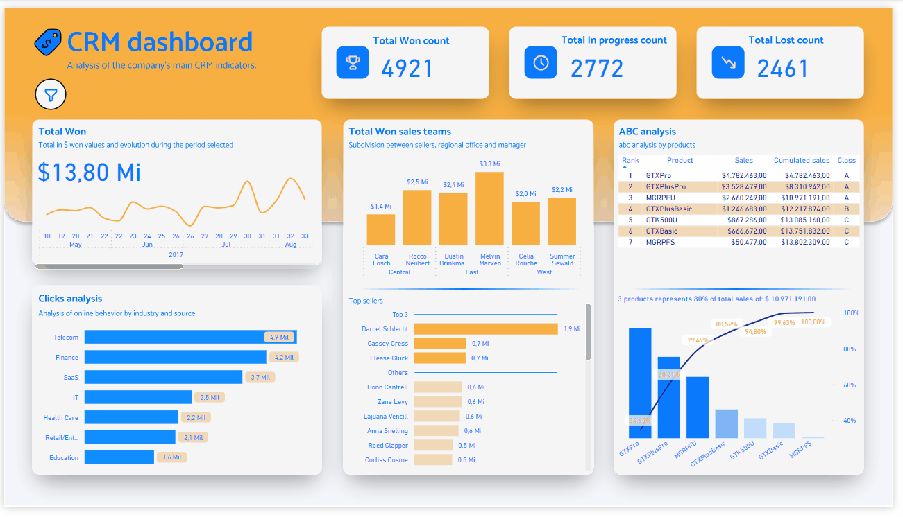

# CRM-analysis---Power-BI-dashboard

### This data analysis project in Power BI is a final step in the data modeling and data warehouse construction project with Pentaho Data Integration. The project can be accessed through this [link](https://medium.com/@heckheck2/constru%C3%A7%C3%A3o-de-um-data-warehouse-com-pentaho-data-integration-pdi-implementando-o-etl-para-uma-746b10fe9f14). The project is originally written in Portuguese.

## Objective

#### The objective of this work is to highlight the creation of dashboards using a data warehouse as a data source. In addition to this, I bring the importance of creating graphs that provide a dynamic analysis for the user with emphasis on visual attributes made in Figma and the application of storytelling.

## Dashboard

#### The dashboard has only one tab highlighting the sales analysis of a fictitious CRM. We can identify sales analysis by products, sales managers and their salespeople, evolution of totals sold at the end of the sales pipeline and counts within the sales phases. It is also possible to see the analysis of clicks from potential customers.

&nbsp;

### Main indicator

#### The main indicator of this BI shows the total in monetary values ​​for completed sales together with their evolution over the time selected in the filter.
#### Below, it is possible to understand the behavior of customers by analyzing clicks. It is possible to evaluate, through drill down, the source of clicks and which industries (categorical variable in the table) had the most clicks.
&nbsp;

### ABC analysis

#### Personally, ABC analysis is my favorite indicator. This metric can be applied to any business area to understand the main influencers and their impact on revenue. Here, this analysis is done by products sold. Since there are few items in the catalog, the analysis becomes pleasant and objective, and it is possible to easily visualize the most important and least important products.
&nbsp;

### Seller's and Manager's analysis

#### Sales analysis by manager, regional office and sellers highlights the top three sellers regardless of the filter applied. An important data storytelling technique is applied here, which is to highlight the top three sellers. The user can clearly identify the highlights and, with each filter applied, can evaluate the sellers' performance.

## Conclusion 

#### This Power BI dashboard is the final step in the data warehouse construction project involving Pentaho Data Integration and Postgres database. The CRM dashboard is a data analysis project that uses the main features available in traditional BI. Snowflake patterns were used to model the data in BI, the same pattern implemented in the data warehouse.

## Author
- Tiago Bratz Heck
##### Access my [LinkedIn](https://www.linkedin.com/in/tiago-bratz-heck-0b9b5696/) profile.